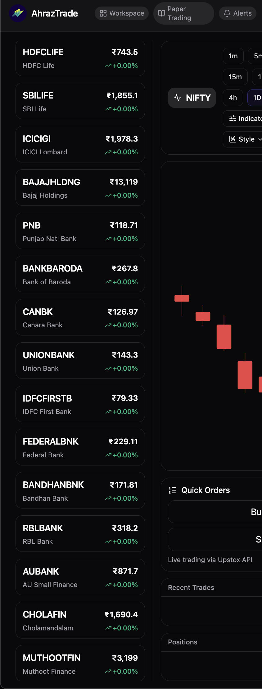

# AhrazTrade — Professional Trading Platform# AhrazTrade - Professional Trading Platform# AhrazTrade - Professional Trading Platform# AhrazTrade - Professional Trading Platform# AhrazTrade - Professional Trading Platform


A modern, real‑time trading platform powered by **Upstox API v2** with live WebSocket market‑data streaming.


## ✨ HighlightsA modern, real-time trading platform powered by **Upstox API v2** with live WebSocket market data streaming.


✅ Live market data via WebSocket (tick‑level updates)  

✅ Interactive charts (candles, multiple timeframes)  

✅ Order book & recent trades  ## 📸 ScreenshotsA modern, real-time trading platform powered by **Upstox API v2** with live WebSocket market data streaming.

✅ Portfolio & P&L tracking  

✅ 210+ Indian equities across major sectors  

✅ Light/Dark theme and fully responsive UI  

### Main Trading Interface

Built with **React 19**, **Vite**, **Tailwind CSS**, **Framer Motion**, **Protobuf**, and **Upstox API v2**.


## 📸 Screenshots

## 📸 ScreenshotsA modern, real-time trading platform powered by **Upstox API v2** with live WebSocket market data streaming.

### Main Trading Interface

### Live Market Data


### Live Market Data


## 🧱 Tech Stack

## 🚀 Features### Main Trading Interface

- **React 19** — modern UI framework

- **Vite** — lightning‑fast dev/build

- **Tailwind CSS** — utility‑first styling

- **Framer Motion** — smooth animations✅ **Real-time Market Data** - Live price updates via WebSocket  

- **Upstox API v2** — auth + market data

- **WebSockets** — real‑time streams✅ **Interactive Charts** - Candlestick charts with multiple timeframes  

- **Protobuf** — efficient data serialization

✅ **210+ Indian Stocks** - Comprehensive coverage across all sectors  ## 📸 ScreenshotsA modern, real-time trading platform powered by **Upstox API v2** with live WebSocket market data streaming.This template provides a minimal setup to get React working in Vite with HMR and some ESLint rules.

## 🚀 Getting Started

✅ **Order Book** - Live bid/ask prices  

### 1) Prerequisites

✅ **Portfolio Tracking** - Monitor positions and P&L  ### Live Market Data

- Node.js ≥ 18 and npm ≥ 9

- An Upstox developer account & app credentials✅ **Trade History** - View recent trades  


### 2) Create an Upstox App✅ **Dark Mode** - Beautiful dark/light theme  


1. Visit the [Upstox Developer Console](https://api.upstox.com/)✅ **Responsive Design** - Works on all screen sizes  

2. Create a new application

3. Note your **API Key** (Client ID) and **API Secret** (Client Secret)

4. Set **Redirect URI** to: `http://localhost:5173/callback`

## 🛠️ Tech Stack

### 3) Configure Environment Variables

## 🚀 Features### Main Trading Interface

Create a `.env` file in the project root:

- **React 19** - Modern UI framework

```env

VITE_UPSTOX_API_KEY=your_api_key_here- **Vite** - Lightning-fast build tool

VITE_UPSTOX_API_SECRET=your_api_secret_here

VITE_UPSTOX_REDIRECT_URI=http://localhost:5173/callback- **Tailwind CSS** - Utility-first styling

```

- **Framer Motion** - Smooth animations✅ **Real-time Market Data** - Live price updates via WebSocket  

**Security tip:** Never commit real credentials. Use `.gitignore` for `.env` and consider `.env.example` for shared defaults.

- **Upstox API v2** - Real-time market data

### 4) Install & Run

- **WebSocket** - Live data streaming✅ **Interactive Charts** - Candlestick charts with multiple timeframes  

```bash

# install deps- **Protobuf** - Efficient data serialization

npm install

✅ **210+ Indian Stocks** - Comprehensive coverage across all sectors  ## 🚀 FeaturesCurrently, two official plugins are available:

# start dev server

npm run dev## 📋 Setup Instructions


# open the app✅ **Order Book** - Live bid/ask prices  

# → http://localhost:5173

```### 1. Get Upstox API Credentials


### 5) Production Builds✅ **Portfolio Tracking** - Monitor positions and P&L  ### Live Market Data


```bash1. Visit [Upstox Developer Console](https://api.upstox.com/)

# create an optimized build

npm run build2. Create a new app✅ **Trade History** - View recent trades  


# preview the production build locally3. Note down your **API Key** (Client ID) and **API Secret** (Client Secret)

npm run preview

```4. Set the **Redirect URI** to: `http://localhost:5173/callback`✅ **Dark Mode** - Beautiful dark/light theme  


## 📁 Project Structure


```### 2. Configure Environment Variables✅ **Responsive Design** - Works on all screen sizes  

AhrazTrade/

├─ src/

│  ├─ assets/

│  │  └─ images/           # S1.png, S2.png, logo.jpgCreate a `.env` file and add your credentials:

│  ├─ components/          # Reusable UI pieces

│  │  ├─ AuthCallback.jsx```env

│  │  ├─ ChartPanel.jsx

│  │  ├─ LoginScreen.jsxVITE_UPSTOX_API_KEY=your_api_key_here## 🛠️ Tech Stack

│  │  ├─ MiniStat.jsx

│  │  ├─ OrderBook.jsxVITE_UPSTOX_API_SECRET=your_api_secret_here

│  │  ├─ Portfolio.jsx

│  │  ├─ Sidebar.jsxVITE_UPSTOX_REDIRECT_URI=http://localhost:5173/callback## 🚀 Features✅ **Real-time Market Data** - Live price updates via WebSocket  - [@vitejs/plugin-react](https://github.com/vitejs/vite-plugin-react/blob/main/packages/plugin-react) uses [Babel](https://babeljs.io/) (or [oxc](https://oxc.rs) when used in [rolldown-vite](https://vite.dev/guide/rolldown)) for Fast Refresh

│  │  ├─ TimeframeBar.jsx

│  │  ├─ TopBar.jsx```

│  │  └─ Trades.jsx

│  ├─ config/- **React 19** - Modern UI framework

│  │  └─ upstox.config.js  # Stock symbols & API config

│  ├─ hooks/               # Custom React hooks### 3. Install & Run

│  │  └─ useUpstox.js

│  ├─ services/            # API & WebSocket services- **Vite** - Lightning-fast build tool

│  │  ├─ upstoxService.js

│  │  └─ websocketService.js```bash

│  ├─ utils/               # Helpers, formatters

│  │  └─ helpers.jsnpm install- **Tailwind CSS** - Utility-first styling

│  ├─ index.css            # Tailwind & CSS

│  ├─ App.jsx              # Main app componentnpm run dev

│  └─ main.jsx             # App bootstrap

├─ public/                 # Static assets```- **Framer Motion** - Smooth animations✅ **Real-time Market Data** - Live price updates via WebSocket  ✅ **Interactive Charts** - Candlestick charts with multiple timeframes  - [@vitejs/plugin-react-swc](https://github.com/vitejs/vite-plugin-react/blob/main/packages/plugin-react-swc) uses [SWC](https://swc.rs/) for Fast Refresh

├─ .env.example            # Sample env vars (no secrets)

├─ .gitignore

├─ index.html

├─ package.jsonVisit `http://localhost:5173` and click "Login with Upstox"!- **Upstox API v2** - Real-time market data

├─ tailwind.config.js

└─ vite.config.js

```

## 📊 Supported Stocks- **WebSocket** - Live data streaming✅ **Interactive Charts** - Candlestick charts with multiple timeframes  

## 🧭 How It Works (Overview)


### Auth flow

The platform includes **210+ Indian stocks** across all major sectors:- **Protobuf** - Efficient data serialization

1. The app redirects users to Upstox for login/consent

2. Upstox redirects back to `VITE_UPSTOX_REDIRECT_URI` with code/state- Banking & Financial Services (25 stocks)

3. The app exchanges the code for tokens, then initializes streams

- IT & Technology (20 stocks)✅ **210+ Indian Stocks** - Comprehensive coverage across all sectors  ✅ **Order Book** - Live bid/ask prices  

### Market data

- Automobiles (20 stocks)

1. WebSocket connects to Upstox streaming endpoint after auth

2. Protobuf messages are decoded into ticks (LTP), depth, trades, etc.- Pharmaceuticals (20 stocks)## 📋 Setup Instructions

3. UI updates charts, order book, and P&L in real time

- FMCG (19 stocks)

### State & performance

- Metals & Mining (15 stocks)✅ **Order Book** - Live bid/ask prices  

- Batched updates and memoization to keep the UI smooth at high tick rates

- Optional back‑pressure strategies for extreme volumes- Energy & Power (15 stocks)


## 📊 Instruments Coverage- Telecom (10 stocks)### 1. Get Upstox API Credentials


The default bundle includes **210+ Indian stocks** across sectors such as:- Real Estate (10 stocks)


- Banking & Financial Services (25 stocks)- And many more...✅ **Portfolio Tracking** - Monitor positions and P&L  ✅ **Portfolio Tracking** - Monitor positions and P&L  ## React Compiler

- IT & Technology (20 stocks)

- Automobiles (20 stocks)

- Pharmaceuticals (20 stocks)

- FMCG (19 stocks)## 🔧 Development1. Visit [Upstox Developer Console](https://api.upstox.com/)

- Metals & Mining (15 stocks)

- Energy & Power (15 stocks)

- Telecom (10 stocks)

- Real Estate (10 stocks)```bash2. Create a new app✅ **Trade History** - View recent trades  

- And many more...

# Install dependencies

You can customize the universe by editing the instrument list in `src/config/upstox.config.js`.

npm install3. Note down your **API Key** (Client ID) and **API Secret** (Client Secret)

## 🛠️ NPM Scripts


```json

{# Start development server4. Set the **Redirect URI** to: `http://localhost:5173/callback`✅ **Dark Mode** - Beautiful dark/light theme  ✅ **Trade History** - View recent trades  

  "scripts": {

    "dev": "vite",npm run dev

    "build": "vite build",

    "preview": "vite preview"

  }

}# Build for production

```

npm run build### 2. Configure Environment Variables✅ **Responsive Design** - Works on all screen sizes  

## 🧪 Local Development Notes


- Keep React Strict Mode enabled to surface lifecycle issues

- Use network throttling in DevTools to simulate slower links# Preview production build

- For charts, prefer windowed or time‑bucketed updates when possible

npm run preview

## 🚑 Troubleshooting

```Create a `.env` file and add your credentials:✅ **Dark Mode** - Beautiful dark/light theme  The React Compiler is not enabled on this template because of its impact on dev & build performances. To add it, see [this documentation](https://react.dev/learn/react-compiler/installation).

**Blank screen after login** → Verify `VITE_UPSTOX_REDIRECT_URI` matches exactly in Upstox console and `.env`.


**No live ticks** → Confirm WebSocket permissions on your Upstox app; check network tab for 101 upgrade and frames.

## 📖 Documentation```env

**CORS or 401 errors** → Your token may be invalid/expired; redo the auth flow.


**Images not loading** → Ensure paths are correct (`public/` vs `src/assets/`) and imported properly.

For detailed documentation, see:VITE_UPSTOX_API_KEY=your_api_key_here## 🛠️ Tech Stack

## 🔒 Security & Compliance

- `SETUP.md` - Detailed setup guide

- Do not expose client secrets in the browser or commit them to git

- Consider a minimal backend for token exchange/refresh and secrets management- `CREDENTIALS.md` - API credentials informationVITE_UPSTOX_API_SECRET=your_api_secret_here

- Review Upstox API terms for production usage

- Code comments throughout the project

## 🗺️ Roadmap

VITE_UPSTOX_REDIRECT_URI=http://localhost:5173/callback✅ **Responsive Design** - Works on all screen sizes  

- [ ] Options chain & Greeks

- [ ] OCO/Bracket orders## 🤝 Contributing

- [ ] Alerts & notifications

- [ ] Multi‑watchlists and layouts```

- [ ] Advanced drawing tools on charts

Contributions are welcome! Feel free to open issues or submit pull requests.

## 🤝 Contributing

- **React 19** - Modern UI framework

Contributions welcome! Please open an issue or PR with a clear description.

## 📄 License

1. Fork the repo

2. Create a feature branch (`feat/your‑feature`)### 3. Install & Run

3. Commit with conventional messages

4. Open a PRThis project is open source and available under the MIT License.


## 📄 License- **Vite** - Lightning-fast build tool## Expanding the ESLint configuration


MIT — see LICENSE for details.---


---```bash


**Happy Trading!** 📈**Happy Trading!** 📈


Built with ❤️ by [Ahraz](https://github.com/ahraz77)npm install- **Tailwind CSS** - Utility-first styling


Built with ❤️ by [Ahraz](https://github.com/ahraz77)

npm run dev

```- **Framer Motion** - Smooth animations## 📋 Setup Instructions


Visit `http://localhost:5173` and click "Login with Upstox"!- **Upstox API v2** - Real-time market data


## 📊 Supported Stocks- **WebSocket** - Live data streamingIf you are developing a production application, we recommend using TypeScript with type-aware lint rules enabled. Check out the [TS template](https://github.com/vitejs/vite/tree/main/packages/create-vite/template-react-ts) for information on how to integrate TypeScript and [`typescript-eslint`](https://typescript-eslint.io) in your project.


The platform includes **210+ Indian stocks** across all major sectors:- **Protobuf** - Efficient data serialization

- Banking & Financial Services (25 stocks)

- IT & Technology (20 stocks)### 1. Get Upstox API Credentials

- Automobiles (20 stocks)

- Pharmaceuticals (20 stocks)## 📋 Setup Instructions

- FMCG (19 stocks)

- Metals & Mining (15 stocks)1. Visit [Upstox Developer Console](https://api.upstox.com/)

- Energy & Power (15 stocks)

- Telecom (10 stocks)### 1. Get Upstox API Credentials2. Create a new app

- Real Estate (10 stocks)

- And many more...3. Note down your **API Key** (Client ID) and **API Secret** (Client Secret)


## 🔧 Development1. Visit [Upstox Developer Console](https://api.upstox.com/)4. Set the **Redirect URI** to: `http://localhost:5173/callback`


```bash2. Create a new app

# Install dependencies

npm install3. Note down your **API Key** (Client ID) and **API Secret** (Client Secret)### 2. Configure Environment Variables


# Start development server4. Set the **Redirect URI** to: `http://localhost:5173/callback`

npm run dev

Edit `.env` and add your credentials:

# Build for production

npm run build### 2. Configure Environment Variables```env


# Preview production buildVITE_UPSTOX_API_KEY=your_api_key_here

npm run preview

```Create a `.env` file and add your credentials:VITE_UPSTOX_API_SECRET=your_api_secret_here


## 📖 Documentation```envVITE_UPSTOX_REDIRECT_URI=http://localhost:5173/callback


For detailed documentation, see:VITE_UPSTOX_API_KEY=your_api_key_here```

- `SETUP.md` - Detailed setup guide

- `CREDENTIALS.md` - API credentials informationVITE_UPSTOX_API_SECRET=your_api_secret_here

- Code comments throughout the project

VITE_UPSTOX_REDIRECT_URI=http://localhost:5173/callback### 3. Install & Run

## 🤝 Contributing

```

Contributions are welcome! Feel free to open issues or submit pull requests.

```bash

## 📄 License

### 3. Install & Runnpm install

This project is open source and available under the MIT License.

npm run dev

---

```bash```

**Happy Trading!** 📈

npm install

Built with ❤️ by [Ahraz](https://github.com/ahraz77)

npm run devVisit `http://localhost:5173` and click "Login with Upstox"!

```

## 📖 Documentation

Visit `http://localhost:5173` and click "Login with Upstox"!

See the full documentation in the comments and code structure.

## 📊 Supported Stocks

**Happy Trading!** 📈

The platform includes **210+ Indian stocks** across all major sectors:# Tradingview-Clone

- Banking & Financial Services (25 stocks)
- IT & Technology (20 stocks)
- Automobiles (20 stocks)
- Pharmaceuticals (20 stocks)
- FMCG (19 stocks)
- Metals & Mining (15 stocks)
- And many more...

## 🔧 Development

```bash
# Install dependencies
npm install

# Start development server
npm run dev

# Build for production
npm run build

# Preview production build
npm run preview
```

## 📖 Documentation

For detailed documentation, see:
- `SETUP.md` - Detailed setup guide
- `CREDENTIALS.md` - API credentials information
- Code comments throughout the project

## 🤝 Contributing

Contributions are welcome! Feel free to open issues or submit pull requests.

## 📄 License

This project is open source and available under the MIT License.

---

**Happy Trading!** 📈

Built with ❤️ by [Ahraz](https://github.com/ahraz77)
