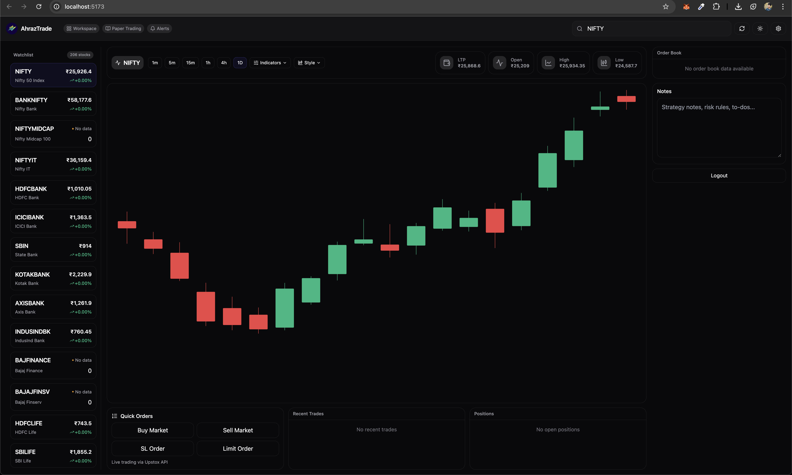

# AhrazTrade – Professional Trading Platform

A modern, real‑time trading platform powered by Upstox API v2, featuring live WebSocket market‑data streaming, interactive charts, and a sleek responsive design.



## ✨ Key Highlights

- ✅ **Real‑time Market Data** — Tick‑level updates via WebSocket
- ✅ **Interactive Charts** — Candlestick visuals with multiple timeframes
- ✅ **Order Book & Trade History** — See live bids, asks, and recent trades
- ✅ **Portfolio Tracking** — Monitor positions and P&L updates
- ✅ **Responsive UI** — Works seamlessly on all screen sizes
- ✅ **Light/Dark Theme** — Elegant design with smooth transitions
- ✅ **210+ Indian Equities** — Coverage across major sectors

## 🧱 Tech Stack

- **React 19** — Modern UI framework
- **Vite** — Lightning‑fast development/build tool
- **Tailwind CSS** — Utility‑first styling
- **Framer Motion** — Smooth, modern animations
- **Upstox API v2** — Authentication & live market data
- **WebSockets** — Real‑time data streams
- **Protobuf** — Efficient binary data serialization

## 📊 Supported Market Coverage

Includes 210+ Indian stocks across diverse sectors:

- Banking & Financial Services (25)
- IT & Technology (20)
- Automobiles (20)
- Pharmaceuticals (20)
- FMCG (19)
- Metals & Mining (15)
- Energy & Power (15)
- Telecom (10)
- Real Estate (10)
- And more...

You can customize the stock universe via `src/config/upstox.config.js`.

## 🚀 Getting Started

### 1. Prerequisites

- Node.js ≥ 18 and npm ≥ 9
- Upstox developer account with registered application credentials

### 2. Obtain Upstox API Credentials

- Visit the [Upstox Developer Console](https://api.upstox.com/)
- Create a new application
- Note your **Client ID** (API Key) and **Client Secret**
- Set the **Redirect URI** to `http://localhost:5173/callback`

### 3. Configure Environment Variables

Create a `.env` file in the project root:

```env
VITE_UPSTOX_API_KEY=your_api_key_here
VITE_UPSTOX_API_SECRET=your_api_secret_here
VITE_UPSTOX_REDIRECT_URI=http://localhost:5173/callback
```

**Security Tip:** Never commit real credentials. Use `.gitignore` for `.env` and provide a `.env.example` template for reference.

### 4. Installation & Run

```bash
# Install dependencies
npm install

# Start development server
npm run dev

# Build for production
npm run build

# Preview production build
npm run preview
```

Then open the app at: 👉 **http://localhost:5173**

## 📁 Project Structure

```
AhrazTrade/
├─ src/
│  ├─ assets/images/        # App logos & UI images
│  ├─ components/           # React components
│  ├─ config/               # Upstox config and symbols
│  ├─ hooks/                # Custom React hooks
│  ├─ services/             # API & WebSocket integrations
│  ├─ utils/                # Helper functions
│  ├─ App.jsx               # Main App component
│  └─ main.jsx              # Entry point
├─ public/                  # Static assets
├─ .env.example             # Environment variable template
├─ package.json
├─ tailwind.config.js
└─ vite.config.js
```

## 🧭 Platform Workflow Overview

### Authentication Flow

1. Redirects user to Upstox login/consent page
2. Upstox returns auth code to redirect URI
3. The app exchanges the code for access tokens
4. Initializes live WebSocket market streams

### Live Market Data

1. Connects to Upstox WebSocket feed
2. Decodes Protobuf messages for LTP, depth, and trade data
3. Updates UI components — charts, order book, and portfolio — in real time

## 🧪 Local Development Notes

- Keep React Strict Mode enabled to detect issues early
- Use Chrome DevTools network throttling to test performance
- For charts, prefer time‑bucketed data for smoother rendering

## 🚑 Troubleshooting

- **Blank screen after login:** Check that `VITE_UPSTOX_REDIRECT_URI` matches exactly in both the Upstox console and `.env`
- **No live data:** Verify WebSocket permissions and ensure connection upgrades (status 101) in the browser network tab
- **401 or CORS error:** Token expired or misconfigured — redo the auth flow
- **Images missing:** Confirm file paths (`public/` vs `src/assets/`)

## 🔒 Security & Compliance

- Never expose API secrets in front-end code
- Use a minimal backend for secure token exchange and refresh
- Follow Upstox API Terms of Use before deploying to production

## 🗺️ Roadmap

- [ ] Options Chain & Greeks
- [ ] OCO/Bracket Orders
- [ ] Alerts & Notifications
- [ ] Multi‑Watchlists
- [ ] Advanced Chart Drawing Tools

## 🤝 Contributing

Contributions are always welcome!

1. Fork the repository
2. Create a feature branch (`feat/your-feature`)
3. Commit changes with conventional messages
4. Open a Pull Request

## 📄 License

Open‑source under the **MIT License**.  
Free to use, modify, and distribute.

---

**Happy Trading! 📈**

*Built with ❤️ by Ahraz*
